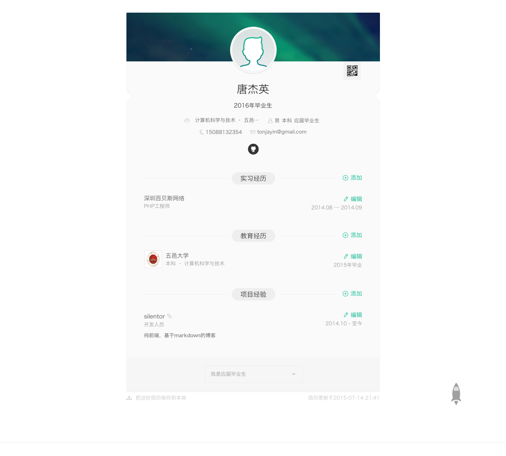

# resume
> 1分钟构建个人的在线简历

### 使用

1. Fork 这个仓库
2. clone 你自己的仓库到本地
3. 修改[resumen.json](resumen.json) 文件，填入你的信息
4. 提交修改并push 到你的GitHub
5. 访问[http://you_username.github.io/resume/build/index.html](http://you_username.github.io/resume/build/index.html)

### 设计目标

### license

MIT
